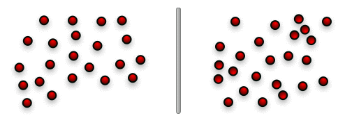
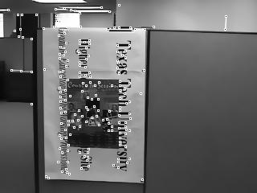
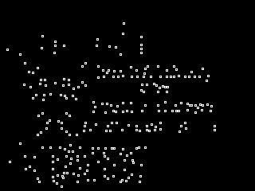
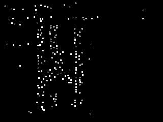

# Point Matching

Point matching is the task of finding correspondences between two
arbitrary sets of points. Usually one point set is designated the
model set, and the other the data set. Associated with any given set
of correspondences is a geometric transformation, which represents the
position, or pose, of the model set within the data set. When this
transformation is applied to the model, the position of the model
points resembles that of the data points.

## Heuristically Seeded Local Search

The Denton/Beveridge point matching algorithm is a heuristically
guided local search algorithm for point matching that performs well
even in the presence of spurious points in the model and data sets.
The algorithm begins with a small set of paired points, and then seeks
to improve upon that match. Each possible single addition, removal,
and swap is considered. If one or more possible improvements are
found, the best improvement is applied to the existing match set and
the process begins again. When no further improvement is found, the
search terminates. The quality of each match set is judged based on
the number of model points matched, the error between the transformed
model and the data, and a penalty for sets of matches that represent
an unlikely geometric transformation.

Beginning a search with a random set of points is unlikely to
produce a good result, so the Denton/Beveridge point matching
algorithms uses a simple heuristic to construct initial matches to
begin the search. This heuristic is based on the observation that
groups of model points that are close to each other should map to
groups of data points that are also close together. A list of all
possible mappings between neighboring model points and neighboring
data points is constructed. This list then provides the starting
points for a number of different rounds of local search, as previously
described.

When there are few spurious points in the model and data set, the
heuristic algorithm frequently identifies starting points that will
quickly lead the local search algorithm to a correct solution. When
there are more spurious points, a larger portion of the list of
starting points must be search before a good solution is found.
Fortunately, the local search algorithm is very fast and it can be run
many times is a short period of time. As more trials are run, the
chance that they have all failed to find a good solution drops towards
zero.

Although this algorithm is very fast, it frequently does not result
in a good match. To compensate, the algorithm can be run many times.
As the algorithm is run repeatedly, the chance that every attempt will
fail drops zero. With enough iterations, it becomes possible to be
confident that the best solution has been found. In practice, the
combination of the heuristic start algorithm and local search often
finds solutions to point matching problems that RANSAC can not, and
does so faster than other traditional search techniques.

## An Example

An example will be helpful. Start with two images, such as those
shown below. The image on the left will provide the model, the one on
the right will be the data.

First, identify all the corner points in these images, using some
automated feature detector such as the 
[Harris corner extractor](http://en.wikipedia.org/wiki/Corner_detection#The_Harris_.26_Stephens_.2F_Plessey_corner_detection_algorithm). This
results in model and data point sets.

These points, and only the information about the point location, is
feed into the point matching software. The program "sees" only
something that looks like the images below.

The algorithm first identifies groups of neighboring points in each
set, and then constructs partial match sets by pairing the groups. For
example, consider the four points on the T and E in the word Texas.
These corners are visible in both sets. These four points are paired
in every possible combination and each grouping feeds one trial of
local search. One of the groupings is correct, and leads the search
algorithm to a series of additional pairs that completes the
match.

At the end the point matching software reports a set of
correspondences and an optimal pose like that shown below.

        ( 18, 70) ( 20, 23) ( 21, 20) ( 22, 43) ( 23,109) ( 24,123) ( 25,151) ( 26, 87) ( 29,177) ( 30,153)
        ( 31, 48) ( 32, 56) ( 33, 93) ( 34,137) ( 36, 67) ( 40, 54) ( 41,104) ( 42, 77) ( 43,157) ( 44,180)
        ( 45, 50) ( 46, 62) ( 47, 66) ( 48, 83) ( 49, 95) ( 51,114) ( 52,125) ( 53,136) ( 54,146) ( 55,152)
        ( 56,159) ( 57,161) ( 59,171) ( 60, 42) ( 61,  0) ( 65,178) ( 66, 18) ( 71,  7) ( 76, 28) ( 77,120)
        ( 78,130) ( 81,132) ( 82,139) ( 87,118) ( 88,141) ( 99, 37) (100,128) (101, 76) (102, 84) (104, 46)
        (105, 55) (107,170) (108,179) (109, 58) (110,103) (111,116) (114,164) (115,168) (116,173) (117, 65)
        (119, 38) (120,169) (123, 61) (124, 80) (125, 96) (126,117) (127,131) (128,142) (131,181) (132, 36)
        (133, 63) (134, 75) (135, 86) (136, 51) (137,167) (141,  6) (146, 27) (147, 59) (148, 64) (149,121)
        (150,156) (151, 39) (153, 82) (154, 26) (155, 53) (156, 94) (157,107) (159,182) (163,158) (164,122)
        (165, 32) (166, 74) (167, 92) (168,102) (169,115) (170,183) (172, 52) (173, 57) (174, 97) (175,108)
        (176,  3) (177,155) (180, 12) (181, 14) (187, 21) (199, 11) (216, 73) (222, 10) (223, 34) (228, 22)
        (232, 71) (234, 33) (236,  9) (238, 29) (247,  4) (253, 69) 
        Pairs: 116 Fitness: 170.8152
        a: 0.015431 b: -1.110821 c: 261.447825 
        d: 1.201859 e: 0.037866 f: -91.858356 
        g: 0.000094 h: 0.000563 

The optimal pose can then be used to transform the model set to
look like the data set. If we transform the first image to look like
the second, and then overlay that with the original second image, we
end up with the following.

## Papers

Details of our technique can be found in the following papers.
Citation information for this papers is available in a 
[BibTex file](https://github.com/jasondenton/Publications/blob/main/jdenton.bib).

* [An Algorithm for Projective Point Matching in the Presence of Spurious Points](https://github.com/jasondenton/Publications/blob/main/prjpm.pdf)
* [Two Dimensional Projective Point Matching (short paper)](https://github.com/jasondenton/Publications/blob/main/2dpntmatch.pdf)
* [Two Dimensional Projective Point Matching (Dissertation)](https://github.com/jasondenton/Publications/blob/main/jdenton_dissertation.pdf)

